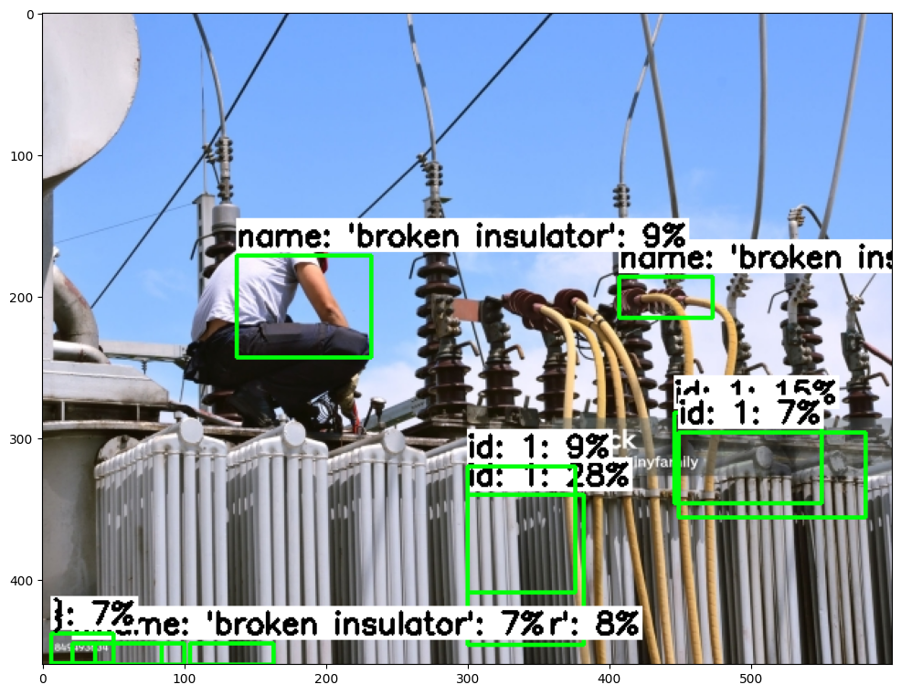
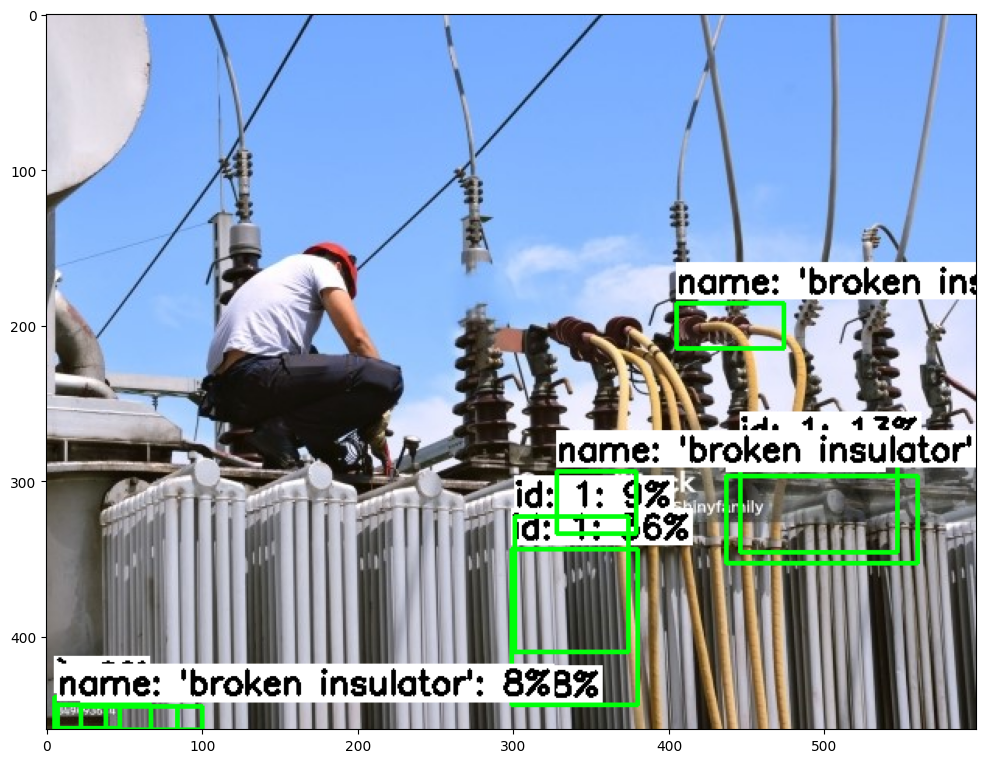
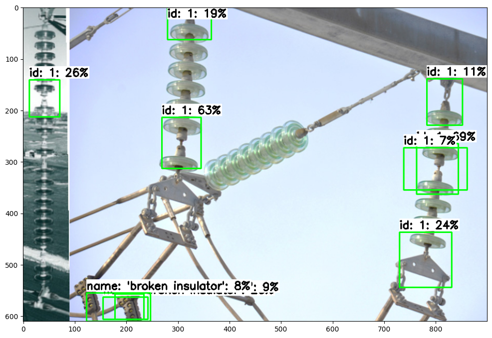

# SSD Object Detection for EEE Project

## Overview

This project implements a Single Shot MultiBox Detector (SSD) using TensorFlow 2 for custom object detection. The project is designed for an Electrical and Electronics Engineering (EEE) course and demonstrates the complete pipeline from model setup to inference on custom datasets.

## Project Structure

```
project/
├── SSD_for_EEE.ipynb          # Main Jupyter notebook with complete implementation
├── 1.png                      # Sample image/result 1
├── 2.png                      # Sample image/result 2  
├── 3.png                      # Sample image/result 3
└── README.md                  # This file
```

## Features

- **Multiple Model Support**: Configurable support for various SSD architectures:
  - SSD MobileNet V2 (320x320)
  - SSD ResNet50 V1 FPN (640x640) 
  - EfficientDet D0
  - SSD MobileNet V2 FPNLite (320x320)

- **Complete Training Pipeline**: 
  - Data preparation and TFRecord generation
  - Model configuration and fine-tuning
  - Training with TensorBoard monitoring
  - Model export to TensorFlow Lite format

- **Inference and Evaluation**:
  - Custom inference function for TFLite models
  - Visualization of detection results
  - Confidence threshold adjustment
  - Results export for mAP calculation

## Sample Results

The project includes sample detection results showcasing the model's performance:


*Detection Result 1: Object detection with bounding boxes and confidence scores*

 
*Detection Result 2: Multi-object detection demonstration*


*Detection Result 3: Model performance on different scenarios*

## Key Components

### 1. Environment Setup
- Google Colab integration with GPU support
- TensorFlow 2.8.0 with CUDA 11.0 compatibility
- TensorFlow Object Detection API installation

### 2. Model Configuration
- Pre-trained model download and setup
- Custom pipeline configuration
- Training parameter optimization:
  - Batch size: 4-8 (depending on model)
  - Training steps: 20,000
  - Configurable confidence thresholds

### 3. Training Process
- Custom dataset integration (train/validation TFRecord files)
- Label map configuration
- TensorBoard monitoring for training visualization
- Checkpoint management and model export

### 4. Model Export and Optimization
- TensorFlow Lite conversion for mobile deployment
- Model quantization support
- Inference optimization for real-time detection

### 5. Inference and Visualization
- Custom detection function with adjustable parameters
- Bounding box visualization with confidence scores
- Support for multiple image formats (JPG, PNG, BMP)
- Results export in standardized format

## Technical Specifications

**Supported Models:**
- **Primary Model**: SSD ResNet50 V1 FPN (640x640)
- **Alternative Models**: MobileNet V2 variants, EfficientDet D0

**Training Configuration:**
- **Framework**: TensorFlow 2.8.0
- **Training Steps**: 20,000 (configurable)
- **Batch Size**: 4-8 (model-dependent)
- **Optimizer**: Adam with cosine decay learning rate
- **Data Augmentation**: Built-in TF Object Detection API augmentations

**Output Formats:**
- **Training**: TensorFlow SavedModel format
- **Deployment**: TensorFlow Lite (.tflite) format
- **Results**: Visualization images and detection coordinates

## Getting Started

### Prerequisites
- Google Colab account (recommended) or local TensorFlow 2.8+ environment
- GPU access for training (recommended)
- Custom dataset in TFRecord format
- Label map file (.pbtxt format)

### Quick Start
1. **Open the notebook**: Launch `SSD_for_EEE.ipynb` in Google Colab
2. **Mount Google Drive**: Connect your Google Drive for data access
3. **Prepare your data**: Ensure train.record, valid.record, and label_map.pbtxt are available
4. **Select model**: Choose from available model configurations
5. **Start training**: Execute training cells and monitor with TensorBoard
6. **Export model**: Convert trained model to TensorFlow Lite format
7. **Run inference**: Test the model on your custom images

### Configuration Options
```python
# Model selection
chosen_model = 'ssd_rest50_v1'  # or 'ssd-mobilenet-v2', 'efficientdet-d0'

# Training parameters
num_steps = 20000
batch_size = 8  # Adjust based on GPU memory

# Inference parameters
min_conf_threshold = 0.5  # Confidence threshold for detections
```

## Applications

This SSD implementation is suitable for various computer vision applications:
- **Industrial Automation**: Component detection and quality control
- **Security Systems**: Object monitoring and surveillance
- **Robotics**: Object recognition for navigation and manipulation
- **Academic Research**: Custom object detection experiments
- **IoT Devices**: Lightweight detection on mobile/embedded platforms

## Performance Optimization

**For Training:**
- Use GPU acceleration (CUDA 11.0 recommended)
- Adjust batch size based on available memory
- Monitor training progress with TensorBoard
- Use data augmentation for better generalization

**For Inference:**
- TensorFlow Lite format for mobile deployment
- Adjust confidence threshold based on use case
- Consider model quantization for further optimization
- Batch processing for multiple images

## Troubleshooting

**Common Issues:**
- **CUDA Compatibility**: Ensure TensorFlow 2.8.0 with CUDA 11.0
- **Memory Errors**: Reduce batch size if encountering OOM errors
- **No Detections**: Lower confidence threshold (try 0.01)
- **Slow Training**: Verify GPU utilization and data pipeline efficiency

## Future Enhancements

- **Multi-class Detection**: Extend to detect multiple object categories
- **Real-time Processing**: Optimize for video stream processing
- **Model Ensemble**: Combine multiple models for improved accuracy
- **Custom Architectures**: Implement newer detection architectures
- **Automated Evaluation**: Add mAP calculation and model comparison

## License

This project is developed for educational purposes as part of an EEE curriculum. Please ensure compliance with TensorFlow and associated libraries' licensing terms.

## Acknowledgments

- TensorFlow Object Detection API team
- Google Colab for providing GPU resources
- Pre-trained models from TensorFlow Model Zoo
- Course instructors and fellow students for guidance and feedback

---

*Project developed for Semester 2 EEE coursework - Object Detection with Deep Learning*
